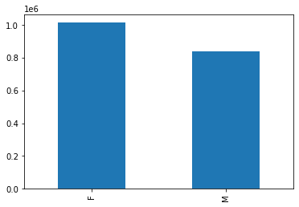
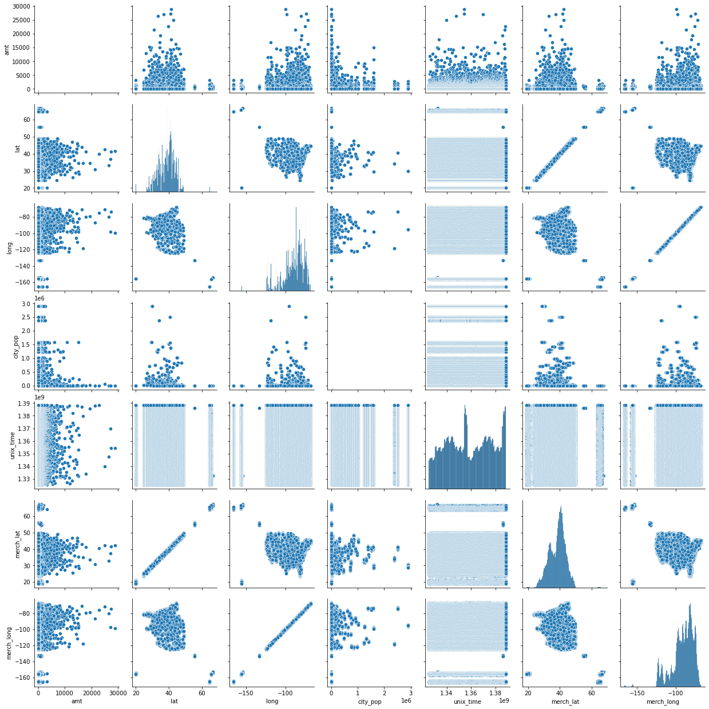
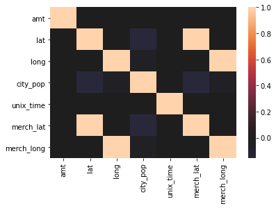
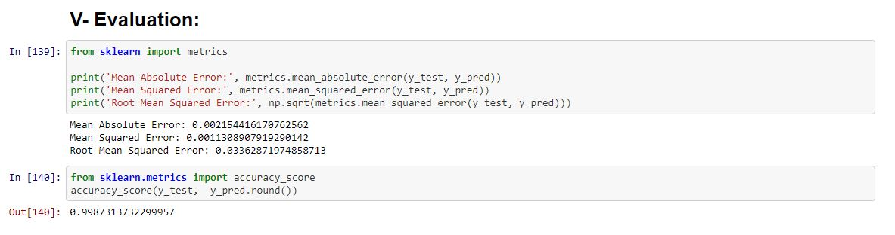

# Credit-Card-Fraud-Detection

A model to identify whether a new transaction is fraudulent or not.
We used CRISP-DM methodology.
First we visualised and cleaned the data without removing outlisers because they will be necessary for the modeling.
Next we calculated the correlation between attributes.
Then feature selection and we tested different machine learning algorithms. The best one was the decision tree.

✅ Keywords: Python, Data Mining, Machine Learning

